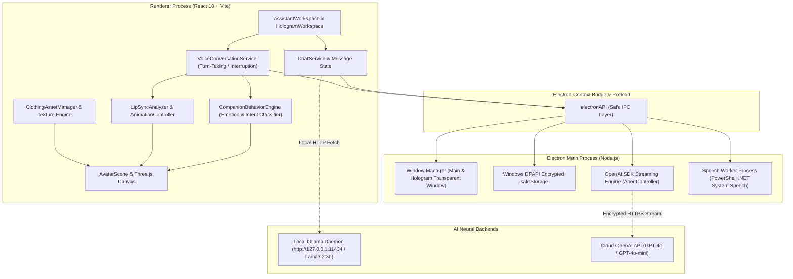

# 🌌 ARIA: AI Hologram Assistant

<div align="center">


<p align="center">
  <strong>An immersive, state-of-the-art 3D Holographic AI Companion for Windows desktops.</strong><br>
  Featuring real-time 3D VRM humanoid avatars, procedural gaze & gestures, 15-viseme audio lip-syncing, hands-free continuous voice conversations with barge-in interruption, dynamic wardrobe customization, and dual local/cloud AI neural backends.
</p>

[Key Features](#-key-features) • [Architecture](#-system-architecture) • [Avatar & Animation](#-3d-avatar--animation-pipeline) • [Voice & Lip-Sync](#-voice-interaction--audio-pipeline) • [AI Providers](#-dual-ai-provider-architecture) • [Getting Started](#-getting-started) • [Documentation](#-project-structure)

</div>

---

## 📖 Executive Summary

**ARIA** (*Adaptive Realtime Intelligent Avatar*) is a next-generation desktop companion engineered with **React 18**, **Three.js / @react-three/fiber**, **VRM 3D humanoid avatars**, and **Electron 31**. 

Designed to blend high-performance computer graphics with real-time conversational artificial intelligence, ARIA runs as a full-featured desktop productivity companion or as a borderless, transparent, floating holographic HUD overlay that hovers directly on your Windows desktop.

### 🌟 Core Philosophy
- **Privacy First**: Complete offline capability using local Ollama models (`llama3.2:3b`, `mistral`, `llama3`). No conversations leave your machine unless cloud mode is explicitly chosen.
- **True Physical Presence**: Procedural micro-saccades, cursor tracking, emotional head tilting, breathing loops, and expressive facial blendshapes eliminate the "uncanny valley".
- **Zero-Latency Audio Sync**: High-resolution audio envelope tracking mapped to 15 distinct phonetic visemes drives real-time mouth shapes at 60 FPS without garbage-collection stutters.
- **Enterprise-Grade Security**: Cloud API keys are isolated exclusively within the Electron main process and secured with Windows DPAPI encryption via `safeStorage`.

---

## 🏛️ System Architecture



---

## 🚀 Key Features

### 1. 🎭 3D Avatar & Procedural Animation System
- **VRM 1.0 & 0.x Humanoid Support**: Directly loads and manipulates `.vrm` and `.glb` character models via `@pixiv/three-vrm`.
- **Procedural Eye & Head Tracking (`AvatarEyeHeadController.ts`)**:
  - Gaze vector tracking follows mouse cursor movements across the screen with natural spherical dampening.
  - Realistic ocular micro-saccades (subtle random eye jitters that prevent static doll-like staring).
  - Autonomous natural blinking with randomized intervals (2.5s - 6.0s) and multi-frame ease-in/ease-out curves.
- **Expressive Facial Blendshapes (`AvatarExpressionController.ts`)**:
  - Dynamically drives VRM expressions: `happy`, `surprised`, `neutral`, `angry`, `sad`, `blink`, and `relaxed`.
  - Maps emotional intent to multi-weight morph combinations (e.g., subtle eyebrow furrow + inquisitive head tilt for confusion).
- **Procedural Upper-Body Kinematics & Gestures (`AvatarGestureController.ts`)**:
  - Generates realistic hand and arm movements without static baked animation clips.
  - Contextual gestures include: *Friendly Wave*, *Thinking Chin-Tap*, *Welcome Open-Arm Presentation*, *Curious Tilt*, and *Conversational Speech Accents*.

### 2. 🎙️ Advanced Audio Pipeline & Lip-Sync
- **15-Viseme Morphing Engine (`LipSyncAnalyzer.ts`)**:
  - Analyzes live synthesis audio envelopes and speech transcripts in real time.
  - Resolves English digraphs (`th`, `ch`, `sh`) and maps vowel phonemes to 15 industry-standard viseme shapes:
    ```
    viseme_aa, viseme_E, viseme_I, viseme_O, viseme_U,
    viseme_PP, viseme_FF, viseme_DD, viseme_kk, viseme_SS,
    viseme_nn, viseme_RR, viseme_TH, viseme_CH, viseme_sil
    ```
  - Compatible with VRM blendshapes (`aa`, `ih`, `ou`, `ee`, `oh`) and Japanese standard targets (`Fcl_MTH_A`, `Fcl_MTH_I`, etc.).
  - Automatic fallback to procedural jaw-bone rotation (`J_Bip_C_Jaw`) for models lacking blendshape morph targets.
- **Zero-Latency Sentence Chunker (`SentenceChunker`)**:
  - Splits streaming AI text deltas into natural prosodic clauses based on punctuation and semantic pauses.
  - Feeds Web Speech Synthesis immediately as tokens arrive, reducing perceived Time-To-First-Audio (TTFA) to under 300ms.

### 3. 🗣️ Hands-Free Voice Dialogue & Barge-In
- **Dual Voice Input Architecture**:
  - **Native Windows Speech Worker (`electron/speech-worker.ps1`)**: Background PowerShell process utilizing .NET `System.Speech.Recognition` for 100% offline speech-to-text without internet access or cloud latency.
  - **Browser Web Speech API**: Fallback integration for modern cross-platform support.
- **Continuous Turn-Taking**: ARIA listens for responses automatically after finishing speaking without requiring manual microphone clicks.
- **Wake-Word Activation**: Activates automatically on phrases: `"Hey Aria"`, `"Aria"`, `"Hello Aria"`, `"OK Aria"`.
- **Barge-In Interruption**: Detecting user speech while ARIA is generating or speaking instantly halts the active TTS stream, aborts AI generation, and pivots ARIA into an attentive listening state.

### 4. 🧠 Dual AI Provider Architecture
- **Local AI (Ollama)**:
  - Connects directly to local Ollama instances (`http://127.0.0.1:11434` / `http://localhost:11434`).
  - Default tested model: `llama3.2:3b`.
  - Dual-host fallback strategy guarantees instant connection on Windows systems by avoiding IPv6 loopback timeouts.
  - Live model inventory retrieval via `/api/tags`.
- **Cloud AI (OpenAI API)**:
  - Secure backend proxy inside Electron main process (`gpt-4o`, `gpt-4o-mini`).
  - Zero token exposure to renderer memory.
  - Full streaming support with abort signals.

### 5. 👗 Dynamic 3D Wardrobe & Garment Retargeting
- **Non-Destructive Texture Swapping (`ClothingAssetManager.ts`)**:
  - Instantaneous material and diffuse map swaps across body, tops, bottoms, and footwear meshes without avatar reload.
  - Pre-packaged outfits:
    - ⚡ *Cyberpunk Default*: Futuristic high-tech operative suit with glowing accents.
    - 🖤 *Dark Gothic Dress*: Elegant Victorian velvet styling.
    - 🌌 *Dark Lace Ensemble*: Modern gothic chic with layered lace detailing.
- **Rigged Garment Retargeting**:
  - Supports loading external `.glb` clothing models.
  - 21-bone humanoid alias map translates bones from Blender, VRoid Studio, ReadyPlayerMe, and Mixamo rigs.
- **Custom Asset Import Modal**: Users can drag and drop custom PNG textures or GLB clothing items directly through the UI.

### 6. 🪟 Desktop Hologram Mode
- **Transparent Borderless HUD**:
  - Spawns a frameless, transparent Electron overlay window (`#00000000`).
  - Floating holographic ARIA companion with holographic scanline shaders and subtle chromatic aberration.
- **Always-on-Top & Click-Through**:
  - Toggle ARIA to remain above full-screen editors, games, or browser windows.
  - Click-through mode (`setIgnoreMouseEvents(true, { forward: true })`) allows interacting with underlying apps unobstructed.
- **Integrated Mini-Chat & Bounds Memory**:
  - Floating glassmorphism input bar for discreet desktop chatting.
  - Auto-persists window positions and dimensions across reboots via `hologram-settings.json`.

---

## 🗂️ Project Structure

```
d:\AI-Hologram-Assistant/
├── 📁 electron/                     # Electron Desktop Subsystem
│   ├── main.ts                     # Main process: Window orchestration, safeStorage DPAPI, IPC
│   ├── preload.ts                  # Secure contextBridge exposing electronAPI to renderer
│   └── speech-worker.ps1           # Offline .NET System.Speech.Recognition PowerShell engine
│
├── 📁 public/                       # Static Distribution Assets
│   ├── icon.ico                    # Windows application executable icon
│   ├── 📁 models/                  # 3D Avatar Models
│   │   ├── aria-anime.vrm          # Primary VRM humanoid companion model
│   │   ├── avatar.vrm / avatar.glb # Binary GLTF / VRM fallbacks
│   │   └── README.md               # 3D model specification and rigging guidelines
│   └── 📁 wardrobe/                # Outfits, Textures, and Thumbnails
│       ├── 📁 models/              # Rigged clothing GLB overlays
│       ├── 📁 textures/            # Cyberpunk, Gothic, and Lace diffuse textures
│       └── 📁 thumbnails/          # High-resolution wardrobe preview cards
│
├── 📁 scratch/                      # Texture extraction and procedural asset staging
│
├── 📁 scripts/                      # Offline Asset & Inspection Tools
│   ├── build-anime-avatar.mjs      # VRM parsing and binary asset builder
│   ├── build-wardrobe-textures.mjs # Procedural wardrobe PNG texture compositor
│   ├── generate-avatar.mjs         # Procedural humanoid mesh generator
│   └── inspect-vrm.mjs             # Node.js CLI tool for dumping VRM nodes and blendshapes
│
├── 📁 src/                          # Frontend Application Source (React 18 + TS)
│   ├── App.tsx                     # Top-level state and view routing (Main vs Hologram)
│   ├── main.tsx                    # React DOM root entrypoint
│   ├── index.css                   # Global design tokens, themes, typography, scrollbars
│   ├── env.d.ts                    # Vite client & Electron window interface typings
│   │
│   ├── 📁 components/              # Modular UI Components
│   │   ├── AssistantWorkspace.tsx  # Primary split-view workstation (3D Canvas + Chat + HUD)
│   │   ├── ChatPanel.tsx           # Rich conversation history, code rendering, speech inputs
│   │   ├── SettingsPanel.tsx       # AI Provider switching, Voice, Hologram, and System configs
│   │   ├── Sidebar.tsx             # Futuristic navigation panel
│   │   ├── WelcomeScreen.tsx       # First-run setup and quick-start wizard
│   │   │
│   │   ├── 📁 avatar/              # 3D Avatar Subsystem
│   │   │   ├── Avatar.tsx          # Master Avatar component binding canvas to logic
│   │   │   ├── AvatarScene.tsx     # Three.js scene, lighting, ground shadows, holographic post-FX
│   │   │   ├── AvatarModel.tsx     # VRM model loader, shader binding, and update loop
│   │   │   ├── AvatarState.ts      # 12 Avatar behavioral states and definitions
│   │   │   ├── AvatarEyeHeadController.ts      # Cursor gaze tracking, micro-saccades, blinks
│   │   │   ├── AvatarExpressionController.ts   # Emotional blendshape morphing
│   │   │   ├── AvatarGestureController.ts      # Procedural arm and hand kinematics
│   │   │   ├── AvatarAnimationController.ts    # Idle breathing cycles and posture shifts
│   │   │   │
│   │   │   ├── 📁 lipsync/         # Real-Time Lip Synchronization Engine
│   │   │   │   ├── LipSyncAnalyzer.ts            # Phoneme-to-viseme parser & audio envelope
│   │   │   │   ├── LipSyncAnimationController.ts # Blendshape and jaw rotation actuator
│   │   │   │   └── LipSyncTypes.ts               # Viseme names and audio envelope contracts
│   │   │   │
│   │   │   └── 📁 wardrobe/        # Customization & Clothing Engine
│   │   │       ├── ClothingAssetManager.ts       # Retargeting, texture swapping, bone attachment
│   │   │       ├── WardrobeModal.tsx             # Outfit selection grid UI
│   │   │       ├── WardrobeUploadModal.tsx       # Custom texture/model upload dialog
│   │   │       └── WardrobeTypes.ts              # Outfit and garment schema definitions
│   │   │
│   │   └── 📁 hologram/            # Floating Desktop Hologram UI
│   │       └── HologramWorkspace.tsx # Borderless transparent floating window interface
│   │
│   ├── 📁 providers/               # AI Neural Backends
│   │   ├── AIProvider.ts           # Unified AI provider interface and message types
│   │   ├── AIProviderManager.ts    # Provider registry and runtime switcher
│   │   ├── LocalAIProvider.ts      # High-performance Ollama HTTP client with IPv4 fallback
│   │   └── CloudAIProvider.ts      # Secure IPC proxy to Electron OpenAI streaming
│   │
│   ├── 📁 services/                # Background Cognitive Services
│   │   ├── ChatService.ts          # Conversation orchestration and provider dispatch
│   │   ├── VoiceConversationService.ts # Continuous dialogue, wake-word, and barge-in
│   │   ├── VoiceInputService.ts    # Speech recognition manager (Windows Worker + WebSpeech)
│   │   ├── TextToSpeechService.ts  # Audio synthesis, sentence chunker, voice profiles
│   │   ├── CompanionBehaviorEngine.ts # Emotion coordination and lerped behavioral states
│   │   ├── EmotionIntentDetector.ts   # Real-time regex and NLP emotion classifier
│   │   ├── AvatarStateService.ts   # Central reactive avatar state emitter
│   │   └── WardrobeManager.ts      # Outfit persistence in localStorage
│   │
│   └── 📁 types/                   # Global TypeScript definitions
│
├── package.json                    # Dependencies, scripts, and electron-builder configs
├── tsconfig.json                   # TypeScript compiler configuration (Renderer)
├── tsconfig.node.json              # TypeScript compiler configuration (Electron Main/Vite)
├── vite.config.ts                  # Vite bundler build options and React plugin
└── walkthrough.md                  # Development history and root-cause resolution logs
```

---

## 🎭 12 Avatar Companion States

ARIA shifts smoothly between 12 distinct companion states managed by `AvatarStateService.ts` and `CompanionBehaviorEngine.ts`:

| State | Display Name | Expression & Posture Behaviors |
| :--- | :--- | :--- |
| `idle` | Neutral Idle | Relaxed upright posture, gentle breathing cycle, natural blinking, eye saccades |
| `listening` | Active Listening | Inquisitive head tilt, focused gaze on user, perked posture, alert expression |
| `thinking` | Processing | Contemplative gaze shift upward-left, procedural hand-to-chin gesture |
| `speaking` | Speaking | Real-time audio lip-syncing, conversational hand gestures, head nod accents |
| `happy` | Joyful / Happy | Radiant warm smile (`Fcl_MTH_Joy` / `mouthSmile`), cheerful open posture |
| `surprised` | Surprised | Wide eyes (`Fcl_EYE_Surprised`), perked head raise, alert reaction |
| `confused` | Puzzled | Puzzled sideways head tilt (14°), subtle inquiring eyebrow brow raise |
| `concerned` | Empathetic | Gentle empathetic posture, caring expression, warm forward tilt |
| `curious` | Inquisitive | Perked head tilt, engaged gaze, inquiring eyebrow articulation |
| `playful` | Playful / Witty | Charming half-smile, witty head tilt, relaxed playful arm posture |
| `excited` | Radiant | Energetic celebratory gesture, bright smile, expressive eye sparkles |
| `interrupted` | Interrupted | Immediate cessation of speech, instant snap to alert listening posture |

---

## 🛠️ Getting Started

### 📋 Prerequisites

- **Operating System**: Windows 10 or Windows 11 (64-bit recommended for native Speech Worker and transparent window features)
- **Node.js**: `v18.0.0` or higher
- **npm**: `v9.0.0` or higher
- **Git**: Installed and accessible in PATH
- *(Optional - for 100% offline Local AI)*: **[Ollama](https://ollama.com/)**

---

### 📥 Installation Steps

1. **Clone the repository**:
   ```bash
   git clone https://github.com/Abhi-web/AI-Hologram-Assistant.git
   cd AI-Hologram-Assistant
   ```

2. **Install Node.js dependencies**:
   ```bash
   npm install
   ```

3. **(Recommended) Setup Local AI with Ollama**:
   Download and install Ollama from [ollama.com](https://ollama.com/). Pull the recommended high-speed compact model:
   ```bash
   ollama pull llama3.2:3b
   ```
   Ensure Ollama is running (`ollama serve` or from your Windows system tray).

4. **Launch the application in development mode**:
   ```bash
   npm run dev
   ```
   This command starts the Vite development server on `http://127.0.0.1:5173` and automatically spawns the Electron desktop container.

---

## ⚙️ Configuration & Settings

All settings can be configured either through the in-app **Settings Panel** or environment variables:

### 1. AI Provider Selection
- Open the application and click **Settings (⚙️)** in the sidebar.
- Choose between:
  - **Local AI (Ollama)**: Automatically detects `http://127.0.0.1:11434`. Click **Test Connection** to verify latency and model status.
  - **Cloud AI (OpenAI)**: Enter your OpenAI API Key (`sk-proj-...`). The key is immediately encrypted into your OS keystore using Chromium DPAPI. Select your desired model (`gpt-4o`, `gpt-4o-mini`).

### 2. Speech & Voice Setup
- **Voice Selection**: Choose any installed Windows or SAPI5 voice profile (e.g., Microsoft Zira, Microsoft David, Natural Voices).
- **Speech Pitch & Rate**: Fine-tune pitch and speech velocity.
- **Continuous Conversation**: Toggle hands-free turn-taking mode.
- **Wake Word Detection**: Enable wake-word trigger phrases (`"Hey Aria"`).

### 3. Hologram Window Controls
- Click **Hologram Mode** in the sidebar.
- Controls available:
  - 📌 **Always on Top**: Keeps ARIA pinned above other windows.
  - 👻 **Click-Through**: Allows mouse clicks to pass through the hologram window to background applications.
  - 💬 **Mini-Chat HUD**: Toggle floating companion chat input bar.

---

## 📜 Available NPM Scripts

| Command | Action | Description |
| :--- | :--- | :--- |
| `npm run dev` | `concurrently ...` | Starts Vite HMR server and launches Electron desktop window concurrently |
| `npm run build` | `vite build && tsc` | Compiles production web bundle and transpile TypeScript Electron scripts |
| `npm run typecheck` | `tsc --noEmit ...` | Validates TypeScript types across both frontend and Electron configs |
| `npm run preview` | `vite preview` | Previews the compiled Vite production bundle locally |
| `npm run electron:dev` | `tsc -p ...` | Runs Electron pointing to the active Vite dev server |

---

## 🔧 Offline Asset Generation Tools

The `scripts/` directory provides standalone utilities for developers wishing to inspect or bake 3D assets:

- **Bake anime avatar model**:
  ```bash
  node scripts/build-anime-avatar.mjs
  ```
- **Composite wardrobe textures**:
  ```bash
  node scripts/build-wardrobe-textures.mjs
  ```
- **Inspect VRM blendshapes and skeleton hierarchy**:
  ```bash
  node scripts/inspect-vrm.mjs
  ```

---

## 🔒 Security & Privacy Notice

1. **Content Security Policy (CSP)**:
   The application enforces a strict CSP in `index.html`:
   ```html
   connect-src 'self' http://localhost:11434 http://127.0.0.1:11434 ws://localhost:5173;
   ```
   This prevents any unauthorized cross-site scripting or unapproved data exfiltration.
2. **Zero-Knowledge API Key Storage**:
   Cloud API keys are stored in encrypted format inside `%APPDATA%/AI-Hologram-Assistant/cloud-ai-config.json`. The renderer process never has access to unmasked credentials.

---

## 🤝 Contributing

Contributions, issues, and feature requests are welcome!

1. Fork the Project (`https://github.com/Abhi-web/AI-Hologram-Assistant/fork`)
2. Create your Feature Branch (`git checkout -b feature/AmazingFeature`)
3. Commit your Changes (`git commit -m 'feat: Add some AmazingFeature'`)
4. Push to the Branch (`git push origin feature/AmazingFeature`)
5. Open a Pull Request

---

## 📄 License

Distributed under the **MIT License**. See `LICENSE` for more information.

---

<div align="center">
  <sub>Built with ❤️ by <a href="https://github.com/Abhi-web">Abhi-web</a>. ARIA Holographic Assistant © 2026.</sub>
</div>
